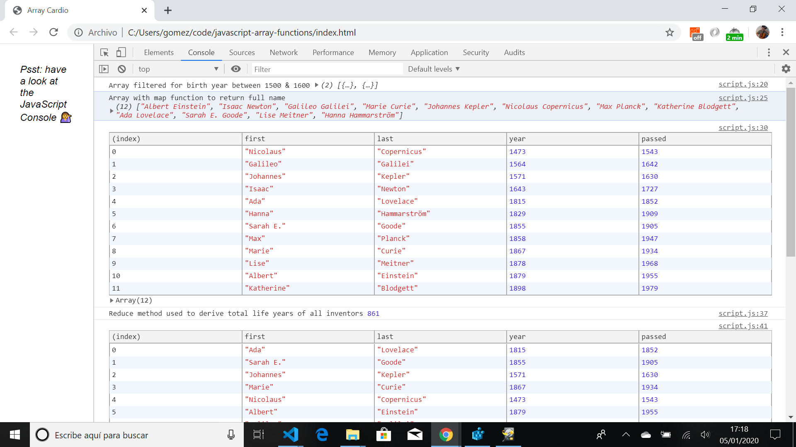
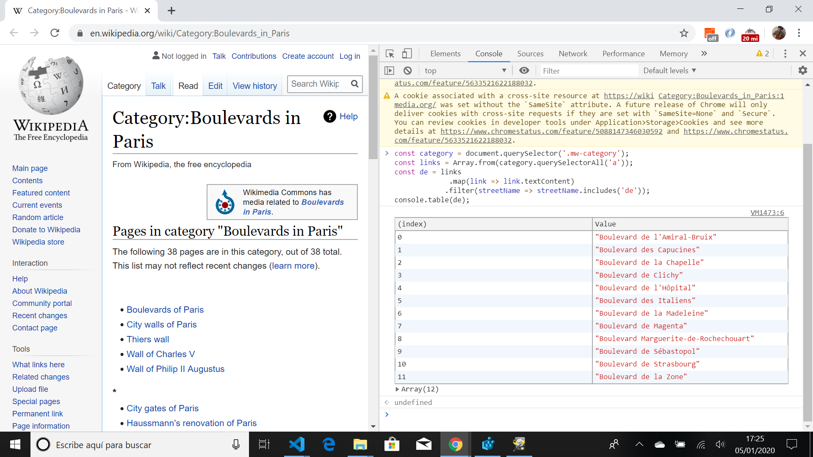

# Javascript Click Checkboxes

Wes Bos Youtube Tutorial: [JavaScript Array Cardio Practice - Day 1 — #JavaScript30 4/30](https://www.youtube.com/watch?v=HB1ZC7czKRs&list=PLu8EoSxDXHP6CGK4YVJhL_VWetA865GOH&index=4).


*** Note: to open web links in a new window use: _ctrl+click on link_**

## Table of contents

* [General info](#general-info)
* [Screenshots](#screenshots)
* [Technologies](#technologies)
* [Setup](#setup)
* [Features](#features)
* [Status](#status)
* [Inspiration](#inspiration)
* [Contact](#contact)

## General info

* Tutorial Code using javascript array methods.

## Screenshots

.
.

## Technologies

* Ran in Google Chrome browser with: [Javascript engine V8 7.9.317.32 for Windows (x64)](https://v8.dev/).

## Setup

* Open index.html in browser. If any code is changed the browser needs to be refreshed. Some code is commented out as it is meant to be used with a particular web link.

## Code Examples

* Sort method used to order an array by birth date.

```javascript
// 5. Sort the inventors by years lived
const yearsLived = inventors.sort((a,b) => (a.passed - a.year) > (b.passed - b.year)? 1 : -1);
console.table(yearsLived);
```

## Features

*  Includes code to filter DOM elements for key words.

## Status & To-Do List

* Status: Working.

* To-Do: Nothing.

## Inspiration

* Wes Bos Youtube Tutorial: [JavaScript Array Cardio Practice - Day 1 — #JavaScript30 4/30](https://www.youtube.com/watch?v=HB1ZC7czKRs&list=PLu8EoSxDXHP6CGK4YVJhL_VWetA865GOH&index=4).

## Contact

Repo created by [ABateman](https://www.andrewbateman.org) - feel free to contact me!